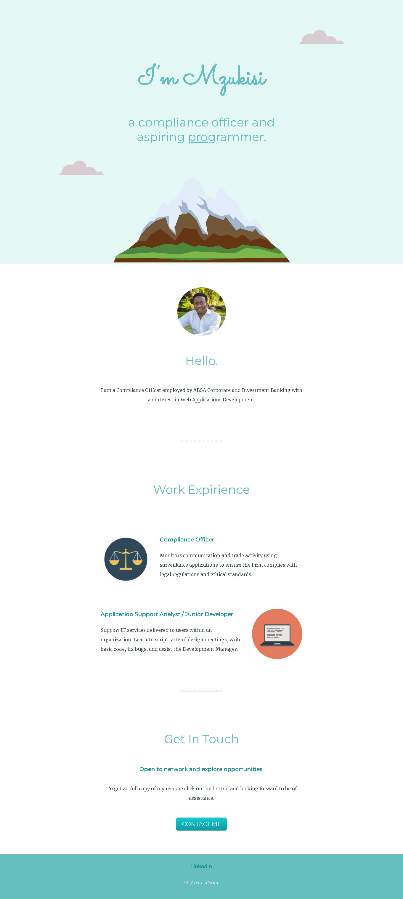

# Udemy - Intermediate CCS exercise

This is my solution to the [CSS My Site Website exercise on Udemy](https://www.udemy.com/course/the-complete-web-development-bootcamp/). The Complete 2022 Web Development Bootcamp is the tutorial I am using to learn full-stack web development.

## Table of contents

- [Overview](#overview)
  - [Screenshot](#screenshot)
  - [Links](#links)
- [My process](#my-process)
  - [Built with](#built-with)
  - [What I learned](#what-i-learned)
  - [Continued development](#continued-development)
  - [Useful resources](#useful-resources)
- [Author](#author)
- [Acknowledgments](#acknowledgments)

## Overview

This website is a html and CSS coding challenge from Udemy's 2022 Coding Bootcamp lectured by Angela Yu. This uses plain html and CSS is to demonstrate styling applied on a website.

### Screenshot

## My process

I used an online app to crop my LinkedIn profile picture.
Added all text, tags, attributes and format.
Customized content to reflect my experience.
Applied styling from top of the page focusing on one section at a time.

### Built with

- Semantic HTML5 markup
- CSS custom properties

### What I learned

I learned how to use html to structure content and CSS to apply styling on the one page website.

Learned the following CSS components:
- Inline, internal, external CSS
- CSS Syntax, Selectors, Classes and IDs
- Display properties
- Static, Relative and Absolute Positioning
- Float and Clear
- Divs
- Favicons

### Continued development

I still have to learn and apply media queries on this page.

### Useful resources

- [MDN Web docs - HTML](https://developer.mozilla.org/en-US/docs/Web/HTML) - This has information to understand html.
- [MDN Web docs - CSS](https://developer.mozilla.org/en-US/docs/Web/CSS) - This has information to understand CSS.
- [W3Schools HTML Tutorial](https://www.w3schools.com/html/) - This has information to understand html.
- [W3Schools CSS Tutorial](https://www.w3schools.com/css/) - This has information to understand CSS.

## Author

- LinkedIn - [Mzukisi Soci](https://www.linkedin.com/in/mzukisi-soci-308521140/)
